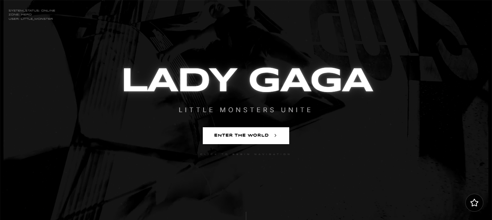
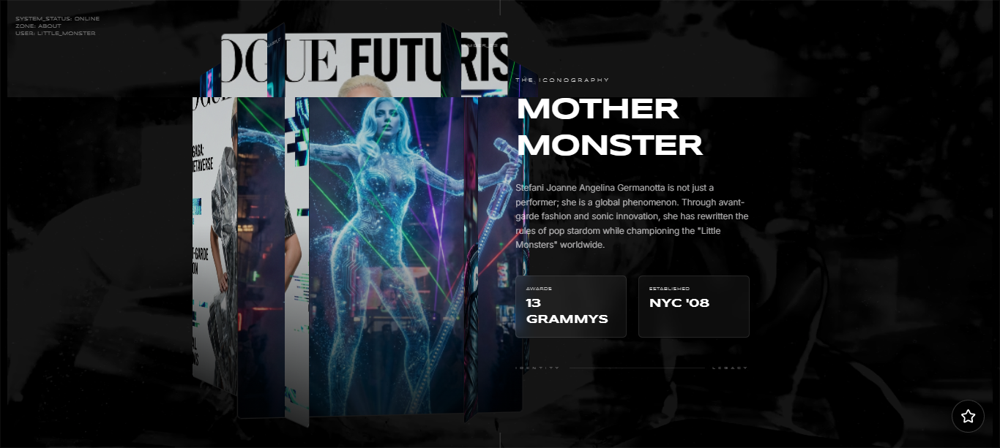
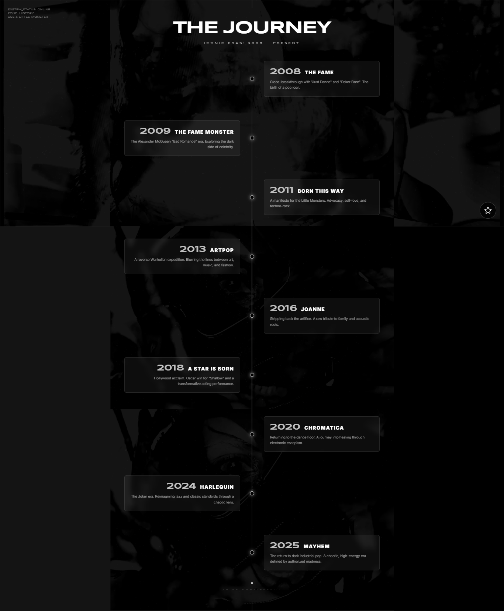
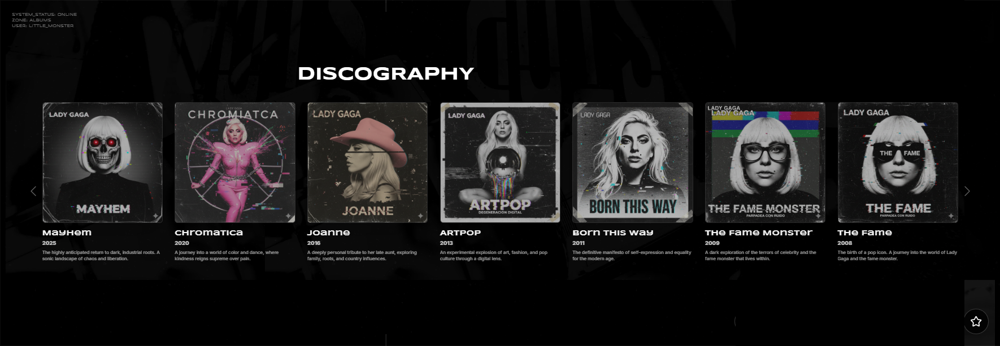
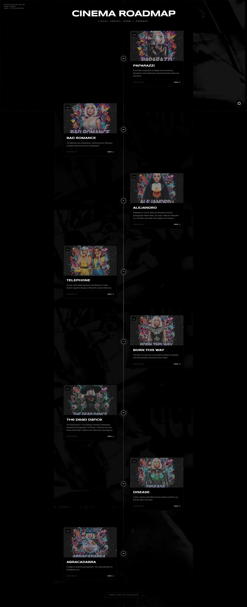
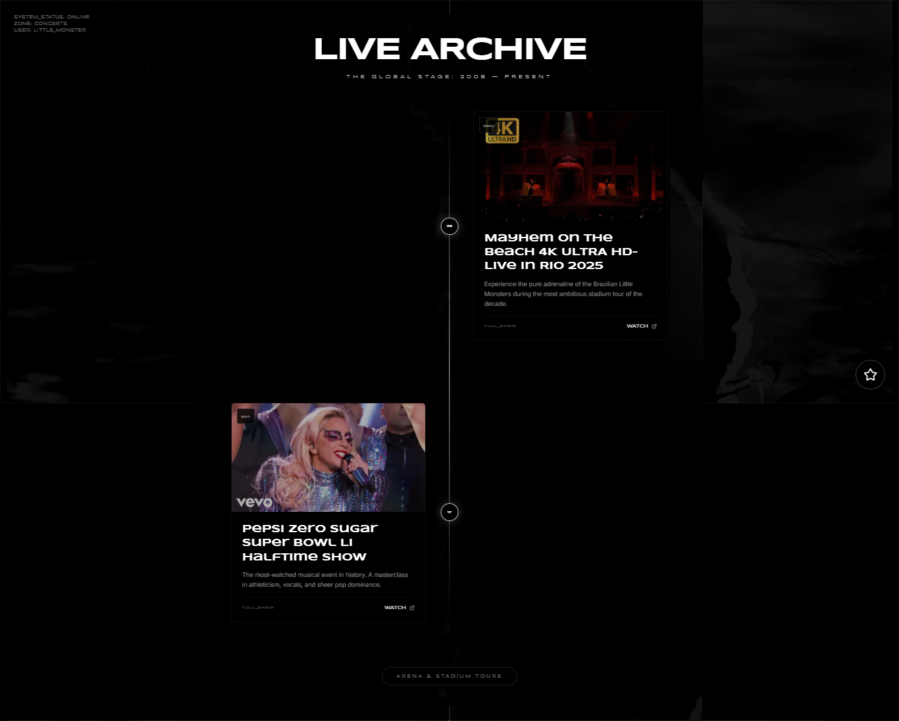
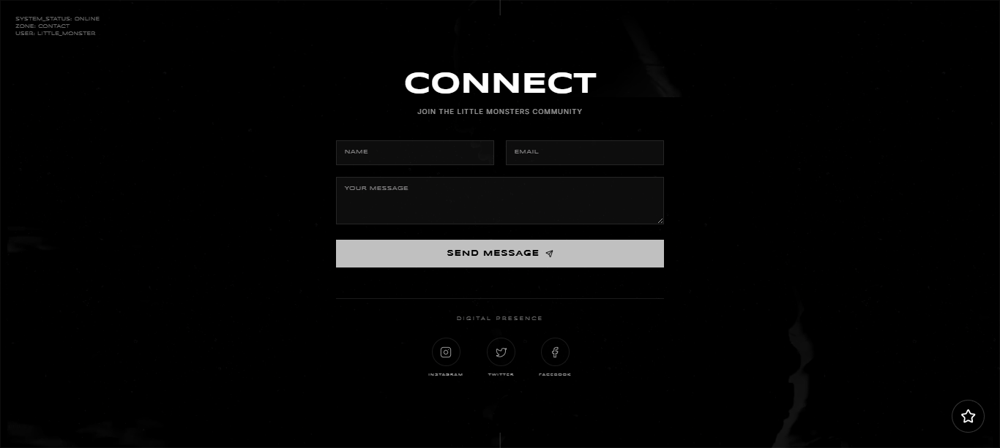

# Lady Gaga Fan Page ⚡️🖤

Una página visualmente inmersiva y dinámica dedicada a Lady Gaga, construida con tecnologías web modernas. Este proyecto presenta una estética única que mezcla vibras industriales, futuristas y retro-tech (VHS), reflejando las eras "Mayhem" y "Chromatica".

 

# Sección Hero



##

# Sección Nosotros



##

# Sección Historia



##

# Sección Álbumes



##

# Sección Videos



##

# Sección Conciertos



##

# Sección Contacto



## 🌟 Características

- **Interfaz Inmersiva:** Efectos de superposición VHS personalizados y elementos HUD "System Status" para una experiencia de usuario única.
- **Fondos Dinámicos:** `BackgroundCarousel` que transiciona suavemente entre imágenes de alta calidad.
- **Navegación Fluida:** Componente `StarNav` para una navegación intuitiva entre las diferentes secciones.
- **Secciones Interactivas:**
  - **Hero:** Pantalla de aterrizaje impactante.
  - **About:** Información sobre la artista.
  - **History:** Una línea de tiempo de las eras.
  - **Albums:** Exhibición de discografía.
  - **Videos:** Portafolio de videos musicales.
  - **Concerts:** Información de giras.
  - **Contact:** Punto de conexión para fans.
- **Animaciones:** Impulsadas por **Framer Motion** y **GSAP** para transiciones fluidas y efectos de movimiento atractivos.
- **Diseño Responsivo:** Diseño totalmente adaptable construido con **Tailwind CSS**.

## 🛠 Stack Tecnológico

- **Framework:** [React](https://react.dev/) (v18+)
- **Herramienta de Construcción:** [Vite](https://vitejs.dev/)
- **Lenguaje:** [TypeScript](https://www.typescriptlang.org/)
- **Estilos:** [Tailwind CSS](https://tailwindcss.com/)
- **Animaciones:**
  - [Framer Motion](https://www.framer.com/motion/)
  - [GSAP](https://greensock.com/gsap/)
- **Iconos:** [Lucide React](https://lucide.dev/)

## 🔧 Implementación Técnica y Refactorización

Este proyecto ha pasado por una refactorización significativa para asegurar escalabilidad y mantenibilidad:

- **Arquitectura Modular:** El código se divide en componentes atómicos (`components/`), diferenciando entre elementos UI reutilizables y secciones específicas de la página (`components/Sections/`).
- **Separación de Datos:** Todo el contenido estático (álbumes, enlaces de videos, eventos del roadmap) está desacoplado de la UI y centralizado en `constants.tsx` con tipado estricto vía `types.ts`. Esto hace que actualizar el contenido sea sencillo sin tocar la lógica de renderizado.
- **Gestión de Assets:** Carga de assets optimizada con una estructura dedicada para visuales.

### 🎭 Estrategia de Animación

La experiencia inmersiva está impulsada por un enfoque de doble motor:

- **Framer Motion:** Maneja las interacciones principales de la UI, incluyendo las transiciones suaves de página con `AnimatePresence`, ventanas modales y la entrada escalonada de elementos de lista (como la línea de tiempo en "History").
- **GSAP (GreenSock):** Utilizado para secuencias complejas de alto rendimiento, particularmente en el `BackgroundCarousel` para crear los efectos visuales cinemáticos y de bucle infinito que definen la atmósfera del sitio.

## 🎨 Dirección Artística

La identidad visual de este proyecto está fuertemente inspirada en la estética de **Randy Prozac**—un estilo glitch-art, cyberpunk y collage industrial.

- **Portadas de Álbumes:** Las portadas "Reimaginadas" presentan imaginería distópica de alto contraste, típica de estructuras industriales masivas y composiciones caóticas, reflejando el concepto "Mayhem".
- **Estética VHS:** Las líneas de escaneo omnipresentes, el ruido y la aberración cromática (implementada vía `VHSOverlay`) rinden homenaje al horror analógico y al retro-futurismo, creando una sensación cruda de "transmisión".

## 🚀 Empezando

### Requisitos Previos

- Node.js (v18 o superior recomendado)
- npm o yarn

### Instalación

1.  Clona el repositorio:
    ```bash
    git clone https://github.com/dannfalcon33/ladygaga-fan-page.git
    ```
2.  Navega al directorio del proyecto:
    ```bash
    cd ladygaga-fan-page
    ```
3.  Instala las dependencias:
    ```bash
    npm install
    ```
4.  Ejecuta el servidor de desarrollo:
    ```bash
    npm run dev
    ```
5.  Abre [http://localhost:5173](http://localhost:5173) para verlo en el navegador.

### Construcción para Producción

Compila la aplicación para despliegue:

```bash
npm run build
```

La salida estará en la carpeta `dist`.

## 📂 Estructura del Proyecto

```bash
src/
├── assets/         # Assets estáticos (imágenes, videos)
├── components/     # Componentes UI reutilizables
│   ├── Sections/   # Secciones de página (Hero, About, etc.)
│   └── ...         # Componentes core (Nav, Carousel, etc.)
├── constants.tsx   # Datos estáticos (Albums, Videos, Roadmap)
├── types.ts        # Definiciones TypeScript
├── App.tsx         # Componente principal de la aplicación
└── main.tsx        # Punto de entrada
```

## Demo en Vivo

[Demo en Vivo](https://ladygagafanpage.netlify.app/)

## Sobre el Desarrollador 👨‍💻

**Yoshua Soto** (Dann Falcon Dev)  
_Fullstack Developer | Especialista en TypeScript_

Creador apasionado por construir aplicaciones que no solo funcionan, sino que asombran. Utilizando la potencia de la IA (Gemini) y tecnologías web modernas, me enfoco en entregar experiencias de usuario (UX) memorables e inmersivas.

📫 **Contacto**

- **Email**: yoshuasoto54@gmail.com
- **WhatsApp**: +58 0422 033 1995

## 🎨 Créditos

- Desarrollo y Diseño: ¡Tú!
- Imágenes: Unsplash y Material Promocional Oficial

---

_"I'm just a definition of the abstract."_ - Lady Gaga


---
